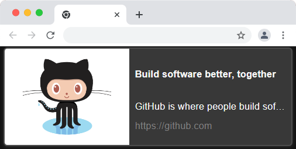
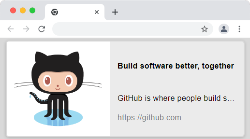
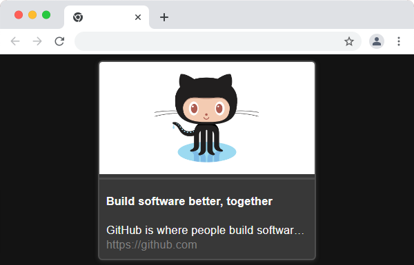

# Themes

Themes, themes are really important because it will make the look of your webpage.
Hyperlinks comes with **5** varieties of themes. They are:- 

- [Dark-horizontal](#dark-horizontal)
- [Light-horizontal](#light-horizontal)
- [Dark-vertical](#dark-vertical)
- [light-vertical](#light-vertical)
    - [Mixed](#mixed)

But more than design, responsive design is also important. Hyerlinks themes, might not fit in your design but will surely adjust in any device size.

Here's some features about hyperlinks themes:-

 

## Dark-horizontal

Dark theme, maybe developers favorite? Anyway, we have dark themes if you like dark. (or if you want to keep bugs away)

*Dark-horizontal* with  `width:min(80vw,55ch)` to make it fit in even small screens.

## Light-horizontal

And now comes the light theme if you want peace. Not everyone likes dark right?

*Light horizontal* same as *Dark horizontal* with one minor difference.. it brings peace..

## Dark-vertical

Horizontal themes, well are fine but might give problems in small screen? Don't worry we have vertical themes to meet your that need.

Vertical themes come with `width:min(60vw,35ch)`, modern CSS reducing media queries! 

## Light Vertical

Again, similar to dark theme but brings peace.

*(Did you know? Light in air is 1.0003 times slower than light in a vacuum)*

## Mixed

At last we have mixed theme, in brief it's a mixture of all above themes, depending on the size of viewport it can be horizontal or vertical.

And using `prefers-color-scheme` which is from *Media Queries Level 5* specification, it can change theme depending on the user selection. (Which means, dark theme users will automatically see dark theme and vice versa)

 

### I am not satisfied

Not satisfied with themes? really? Don't worry, because with hyperlinks you can create your custom theme too!

So, That's it! we will be looking forward to create more themes.
